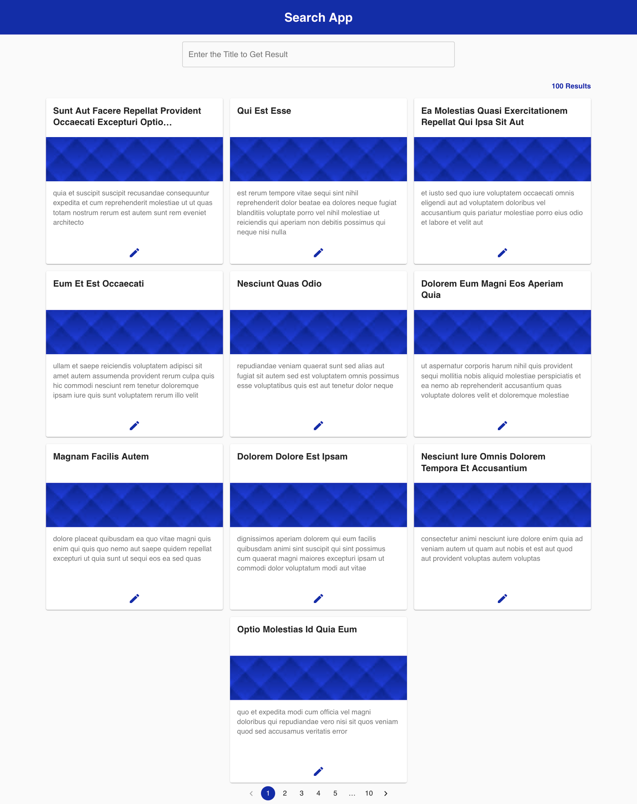
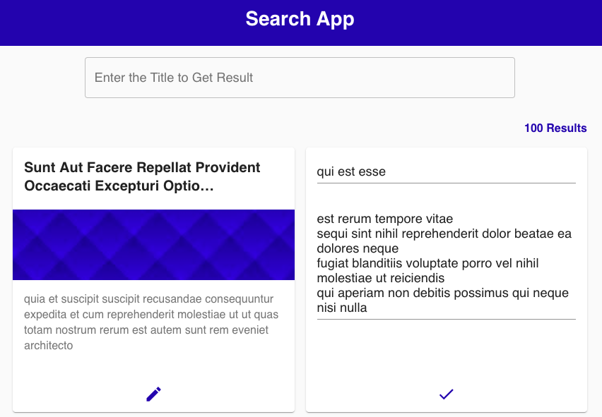

## React Search App

You can easily search Article with title name and will be able to edit the title and discription on the same page. The autocomplete functionality is also there, so, when you search something it will auto-populate.

Here is the screenshot of the  App:

  
  [Edit Field]

## Available Scripts

### `npm i`

Firstly You will have to install all the dependencies

### `npm run server`

Then You will have to start the backend server

### `npm start`

Then You will have to start the front end server

Open [http://localhost:3000](http://localhost:3000) to view the client app in the browser.

The page will reload if you make edits. 
You will also see any lint errors in the console.

### `npm run build`

Builds the app for production to the `build` folder. 
You can easily deploy that folder, it also optimiezes the project

The build is minified and the filenames include the hashes. 
Your app is ready to be deployed!

### `npm run test`

To check the manual testing

### `npm run server:test`

To check the backedn manual testing